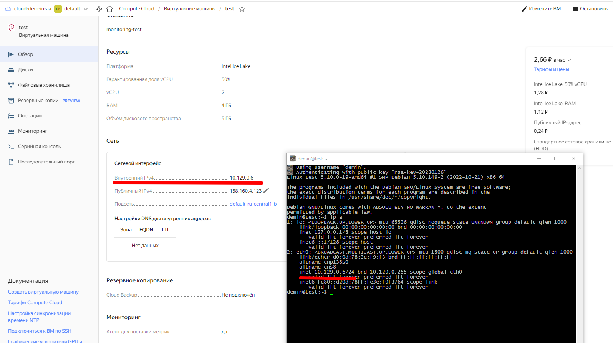
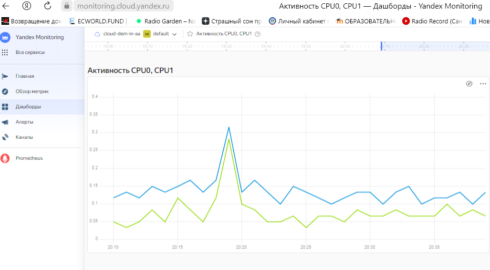
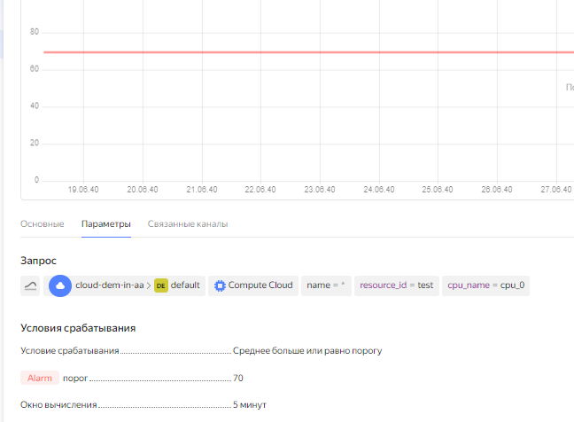
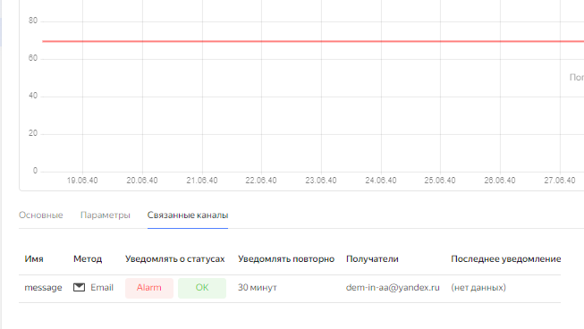
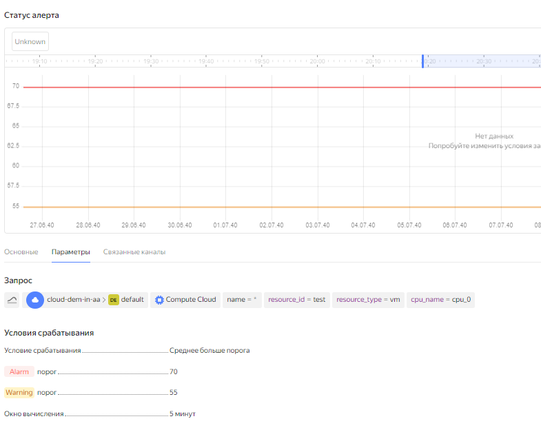
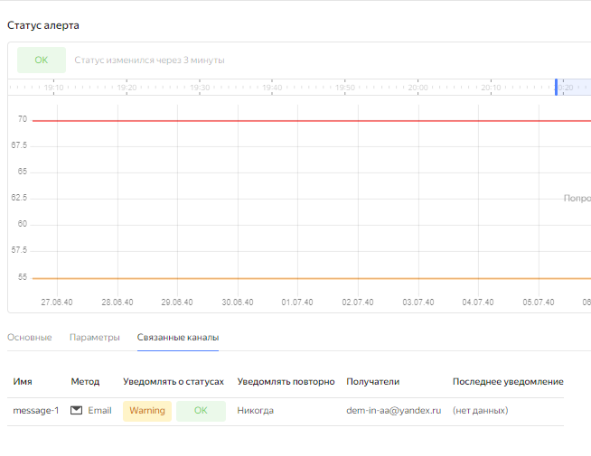
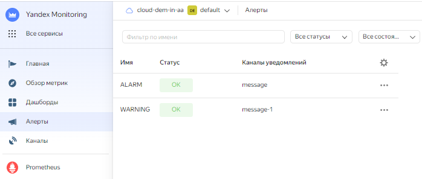

# Домашнее задание к занятию 9.1. «Обзор систем IT-мониторинга» Андрей Дёмин

 
### Задание 1

Создайте виртуальную машину в Yandex Cloud Compute Cloud и с помощью Yandex Monitoring создайте дашборд, на котором будет видно загрузку процессора.

*Приложите скриншот.*

---

### Задание со звёздочкой*
Это дополнительное задание. Его можно не выполнять. Это не повлияет на зачёт. Вы можете его выполнить, если хотите глубже разобраться в материале.

---

### Задание 2*

С помощью Yandex Monitoring сделайте 2 алерта на загрузку процессора: WARN и ALARM. Создайте уведомление по e-mail.

*Приложите скриншот с уведомлением.*

